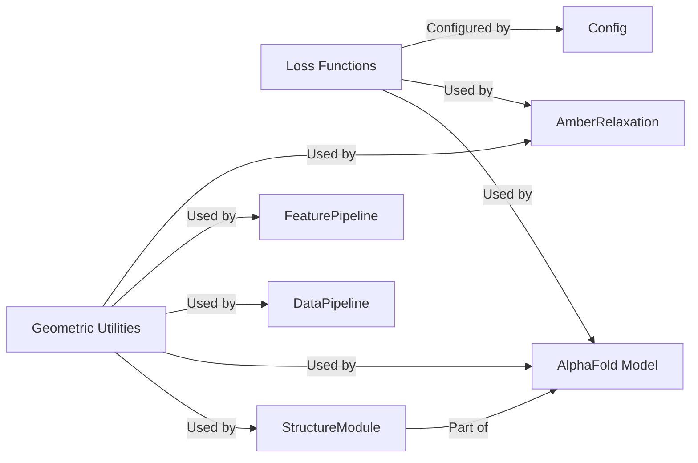

## Details

One paragraph explaining the functionality which is represented by this graph. What the main flow is and what is its purpose.

### Loss Functions

This component implements various loss functions essential for training the AlphaFold model. These functions quantify the discrepancy between the model's predictions and the ground truth, guiding the optimization process. Key losses include FAPE (Frame Aligned Point Error) loss, distogram loss, and masked MSA loss. Additionally, certain loss components might be leveraged during post-prediction refinement steps like energy minimization.

**Related Classes/Methods**:

- <a href="https://github.com/aqlaboratory/openfold/blob/main/openfold/utils/loss.py#L1-L1" target="_blank" rel="noopener noreferrer">`openfold/utils/loss.py` (1:1)</a>

### Geometric Utilities

This component provides a comprehensive set of fundamental operations for 3D geometry, rigid body transformations, and all-atom coordinate manipulations. It is indispensable for representing protein structures, performing geometric calculations, and refining atomic positions throughout the prediction pipeline. This includes handling rotations, translations, and operations on rigid bodies and individual atoms.

**Related Classes/Methods**:

- <a href="https://github.com/aqlaboratory/openfold/blob/main/openfold/utils/geometry/quat_rigid.py#L1-L1" target="_blank" rel="noopener noreferrer">`openfold/utils/geometry/quat_rigid.py` (1:1)</a>

- <a href="https://github.com/aqlaboratory/openfold/blob/main/openfold/utils/geometry/rigid_matrix_vector.py#L1-L1" target="_blank" rel="noopener noreferrer">`openfold/utils/geometry/rigid_matrix_vector.py` (1:1)</a>

- <a href="https://github.com/aqlaboratory/openfold/blob/main/openfold/utils/geometry/rotation_matrix.py#L1-L1" target="_blank" rel="noopener noreferrer">`openfold/utils/geometry/rotation_matrix.py` (1:1)</a>

- <a href="https://github.com/aqlaboratory/openfold/blob/main/openfold/utils/geometry/vector.py#L1-L1" target="_blank" rel="noopener noreferrer">`openfold/utils/geometry/vector.py` (1:1)</a>

- <a href="https://github.com/aqlaboratory/openfold/blob/main/openfold/utils/rigid_utils.py#L1-L1" target="_blank" rel="noopener noreferrer">`openfold/utils/rigid_utils.py` (1:1)</a>

- <a href="https://github.com/aqlaboratory/openfold/blob/main/openfold/utils/all_atom_multimer.py#L1-L1" target="_blank" rel="noopener noreferrer">`openfold/utils/all_atom_multimer.py` (1:1)</a>

### AlphaFold Model [[Expand]](./AlphaFold_Model.md)

**Related Classes/Methods**: _None_

### AmberRelaxation

**Related Classes/Methods**: _None_

### Config

**Related Classes/Methods**: _None_

### StructureModule

**Related Classes/Methods**: _None_

### DataPipeline

**Related Classes/Methods**: _None_

### FeaturePipeline

**Related Classes/Methods**: _None_

### [FAQ](https://github.com/CodeBoarding/GeneratedOnBoardings/tree/main?tab=readme-ov-file#faq)