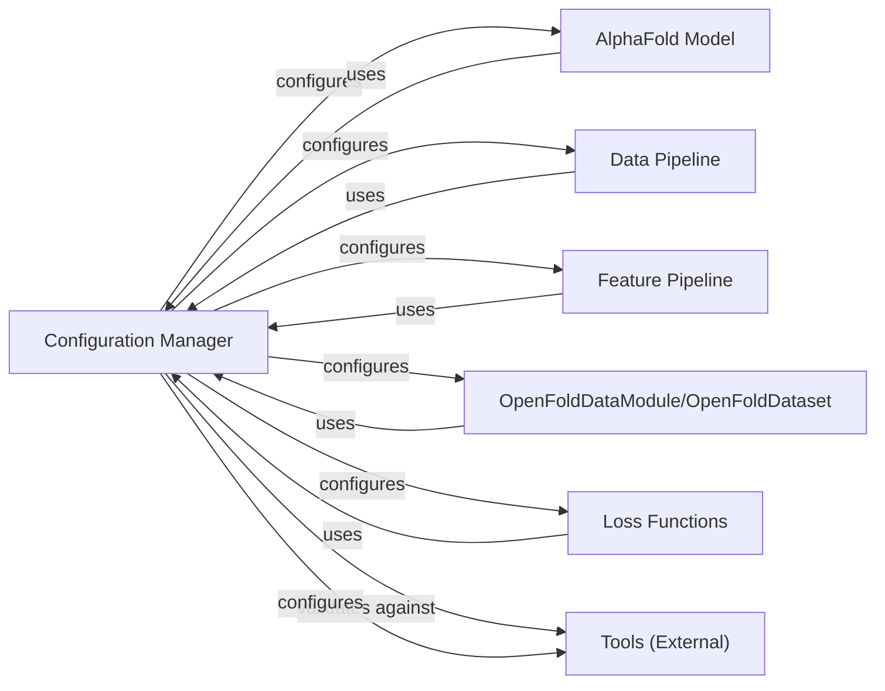

## Details

The `openfold.config` module is central to the `OpenFold` project, acting as the **Configuration Manager**. It's responsible for defining, loading, and validating all configurable parameters, ensuring consistency and flexibility across various experimental setups. Its output highlights the extensive dependencies on configuration throughout the `openfold` package, particularly within the `model` and `data` sub-modules. This confirms its role as a foundational component.

### Configuration Manager

Centralized system for defining, loading, and managing all configurable parameters for the model, data pipelines, and training/inference processes. It leverages `ml_collections.ConfigDict` for hierarchical configuration and includes validation logic.

**Related Classes/Methods**:

- <a href="https://github.com/aqlaboratory/openfold/blob/main/openfold/config.py#L1-L1" target="_blank" rel="noopener noreferrer">`openfold.config` (1:1)</a>

### AlphaFold Model [[Expand]](./AlphaFold_Model.md)

The core deep learning model responsible for predicting protein structures. It consumes features generated by the data pipeline and is configured by the `Configuration Manager`.

**Related Classes/Methods**:

- <a href="https://github.com/aqlaboratory/openfold/blob/main/openfold/model/model.py#L1-L1" target="_blank" rel="noopener noreferrer">`openfold.model.model` (1:1)</a>

### Data Pipeline

Handles the entire process of preparing raw biological data (sequences, templates) into the structured features required by the `AlphaFold Model`. This includes alignment, feature generation, and data loading.

**Related Classes/Methods**:

- <a href="https://github.com/aqlaboratory/openfold/blob/main/openfold/data/data_pipeline.py#L1-L1" target="_blank" rel="noopener noreferrer">`openfold.data.data_pipeline` (1:1)</a>

### Feature Pipeline

A sub-component of the `Data Pipeline` specifically responsible for transforming raw inputs into the numerical features consumed by the `AlphaFold Model`.

**Related Classes/Methods**:

- <a href="https://github.com/aqlaboratory/openfold/blob/main/openfold/data/feature_pipeline.py#L1-L1" target="_blank" rel="noopener noreferrer">`openfold.data.feature_pipeline` (1:1)</a>

### OpenFoldDataModule/OpenFoldDataset

PyTorch Lightning `DataModule` and `Dataset` implementations that encapsulate the data loading logic, integrating with the `Data Pipeline` and `Feature Pipeline` to provide data to the training loop.

**Related Classes/Methods**:

- <a href="https://github.com/aqlaboratory/openfold/blob/main/openfold/data/data_modules.py#L1-L1" target="_blank" rel="noopener noreferrer">`openfold.data.data_modules` (1:1)</a>

### Loss Functions

Implementations of various loss functions used during model training (e.g., FAPE loss, distogram loss, masked MSA loss).

**Related Classes/Methods**:

- <a href="https://github.com/aqlaboratory/openfold/blob/main/openfold/utils/loss.py#L1-L1" target="_blank" rel="noopener noreferrer">`openfold.utils.loss` (1:1)</a>

### Tools (External)

Wrappers for external bioinformatics tools (e.g., HHBlits, Jackhmmer) used by the `Data Pipeline` for tasks like MSA generation and template searching.

**Related Classes/Methods**:

- <a href="https://github.com/aqlaboratory/openfold/blob/main/openfold/data/tools/hhblits.py#L1-L1" target="_blank" rel="noopener noreferrer">`openfold.data.tools.hhblits` (1:1)</a>

- <a href="https://github.com/aqlaboratory/openfold/blob/main/openfold/data/tools/jackhmmer.py#L1-L1" target="_blank" rel="noopener noreferrer">`openfold.data.tools.jackhmmer` (1:1)</a>

### [FAQ](https://github.com/CodeBoarding/GeneratedOnBoardings/tree/main?tab=readme-ov-file#faq)