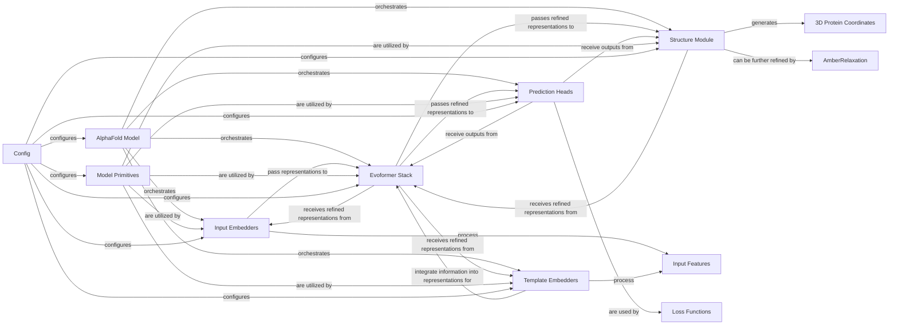

## Details

The `Core AlphaFold Model` subsystem is the heart of the protein structure prediction framework, orchestrating the complex interplay of various neural network modules to transform raw sequence data into a 3D protein structure. Its design reflects the "Modular Deep Learning Architecture" pattern, where specialized components handle distinct aspects of the prediction task, promoting reusability and maintainability.

### AlphaFold Model [[Expand]](./AlphaFold_Model.md)

The top-level orchestrator of the entire protein structure prediction pipeline. It integrates and manages the flow between its internal sub-modules, processing input features to generate the final structural outputs. This is the main entry point for running a prediction.

**Related Classes/Methods**:

- `AlphaFold Model` (1:1)

### Input Embedders

These modules are responsible for the initial transformation of raw input features (e.g., multiple sequence alignments, amino acid sequences) into dense, high-dimensional numerical representations (embeddings) that the neural network can process.

**Related Classes/Methods**:

- `Input Embedders` (1:1)

### Template Embedders

Modules specifically designed to process and embed information derived from known structural templates. This allows the model to leverage existing structural knowledge, which can significantly improve prediction accuracy, especially for proteins with homologous structures.

**Related Classes/Methods**:

- `Template Embedders` (1:1)

- `Template Embedders` (1:1)

### Evoformer Stack

The computational core of the model, consisting of a stack of Evoformer blocks. It iteratively refines the multiple sequence alignment (MSA) and pairwise residue representations through a series of attention mechanisms and triangular multiplicative updates. This module is key to capturing complex evolutionary and spatial relationships within the protein.

**Related Classes/Methods**:

- `Evoformer Stack` (1:1)

### Structure Module

This module takes the refined representations from the Evoformer and iteratively constructs the 3D atomic coordinates of the protein. It predicts backbone and side-chain atom positions using invariant point attention and a series of angle predictions, effectively translating abstract features into a concrete physical structure.

**Related Classes/Methods**:

- `Structure Module` (1:1)

### Prediction Heads

A collection of specialized neural network heads that produce various auxiliary predictions from the Evoformer and Structure Module outputs. These predictions (e.g., distograms, masked MSA, per-residue LDDT-Ca scores) are crucial for calculating diverse loss functions during training, guiding the model's learning process.

**Related Classes/Methods**:

- `Prediction Heads` (1:1)

### Model Primitives

A collection of fundamental, reusable neural network layers and operations (e.g., attention mechanisms, linear transformations, layer normalization). These serve as the basic building blocks for constructing the more complex modules within the AlphaFold model.

**Related Classes/Methods**:

- `Model Primitives` (1:1)

### Input Features

Raw input data for the AlphaFold model.

**Related Classes/Methods**: _None_

### 3D Protein Coordinates

The final predicted 3D structure of the protein.

**Related Classes/Methods**: _None_

### Loss Functions

Functions used during training to guide the model's learning process.

**Related Classes/Methods**: _None_

### Config

Configuration parameters for the AlphaFold model and its components.

**Related Classes/Methods**: _None_

### AmberRelaxation

A post-processing step to refine the predicted protein structure using Amber force fields.

**Related Classes/Methods**: _None_

### [FAQ](https://github.com/CodeBoarding/GeneratedOnBoardings/tree/main?tab=readme-ov-file#faq)