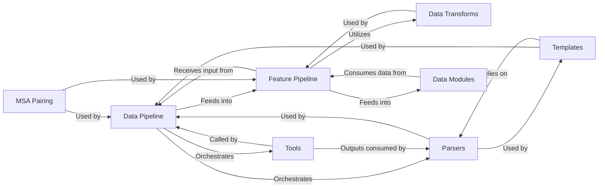

## Details

The Data Processing Pipeline in OpenFold is a critical subsystem responsible for transforming raw biological data into a format suitable for the deep learning model. It encompasses several key components that work in concert to achieve this.

### Data Pipeline

This is the orchestrator of the entire data processing workflow. It manages the execution of external bioinformatics tools to generate MSAs and templates, and coordinates the initial stages of data preparation. It includes specialized logic for multimer data.

**Related Classes/Methods**:

- <a href="https://github.com/aqlaboratory/openfold/blob/main/openfold/data/data_pipeline.py" target="_blank" rel="noopener noreferrer">`data_pipeline`</a>

### Feature Pipeline

Responsible for transforming raw biological data (sequences, MSAs, templates) into the numerical features (tensors) that can be directly consumed by the neural network. It applies various data transformations and prepares the input for the model.

**Related Classes/Methods**:

- <a href="https://github.com/aqlaboratory/openfold/blob/main/openfold/data/feature_pipeline.py" target="_blank" rel="noopener noreferrer">`feature_pipeline`</a>

### Data Transforms

A collection of functions and classes that apply various transformations, augmentations, and normalizations to the raw and intermediate data. This includes operations like cropping, padding, and converting data into model-consumable formats, with specific implementations for multimer data.

**Related Classes/Methods**:

- <a href="https://github.com/aqlaboratory/openfold/blob/main/openfold/data/data_transforms.py" target="_blank" rel="noopener noreferrer">`data_transforms`</a>

- <a href="https://github.com/aqlaboratory/openfold/blob/main/openfold/data/data_transforms_multimer.py" target="_blank" rel="noopener noreferrer">`data_transforms_multimer`</a>

### Tools

Provides Python wrappers and utilities for executing external bioinformatics tools (e.g., HHblits, Jackhmmer, HHsearch, Kalign). These tools are crucial for generating Multiple Sequence Alignments (MSAs) and identifying structural templates, which are essential inputs for the model.

**Related Classes/Methods**:

- `tools`

### Parsers

Handles the parsing of various bioinformatics data formats, including A3M, FASTA, PDB, and MMCIF files. This component extracts relevant information from these files for downstream processing by other parts of the data pipeline.

**Related Classes/Methods**:

- <a href="https://github.com/aqlaboratory/openfold/blob/main/openfold/data/parsers.py" target="_blank" rel="noopener noreferrer">`parsers`</a>

- <a href="https://github.com/aqlaboratory/openfold/blob/main/openfold/data/mmcif_parsing.py" target="_blank" rel="noopener noreferrer">`mmcif_parsing`</a>

### Templates

Manages the identification, processing, and featurization of structural templates. This involves searching for homologous structures, parsing their data, and preparing them as input features for the model. It includes logic for handling various template sources and potential errors.

**Related Classes/Methods**:

- <a href="https://github.com/aqlaboratory/openfold/blob/main/openfold/data/templates.py" target="_blank" rel="noopener noreferrer">`templates`</a>

### MSA Pairing

Specifically handles the pairing and processing of Multiple Sequence Alignments for multimeric protein complexes. This is a critical step for correctly representing inter-chain relationships and generating accurate features for multimer prediction.

**Related Classes/Methods**:

- <a href="https://github.com/aqlaboratory/openfold/blob/main/openfold/data/msa_pairing.py" target="_blank" rel="noopener noreferrer">`msa_pairing`</a>

- <a href="https://github.com/aqlaboratory/openfold/blob/main/openfold/data/feature_processing_multimer.py" target="_blank" rel="noopener noreferrer">`feature_processing_multimer`</a>

### Data Modules

Provides the interface for PyTorch Lightning, handling data loading, batching, and dataset management for training and inference. It wraps the DataPipeline and FeaturePipeline to provide model-ready data in an efficient and structured manner.

**Related Classes/Methods**:

- <a href="https://github.com/aqlaboratory/openfold/blob/main/openfold/data/data_modules.py" target="_blank" rel="noopener noreferrer">`data_modules`</a>

### [FAQ](https://github.com/CodeBoarding/GeneratedOnBoardings/tree/main?tab=readme-ov-file#faq)