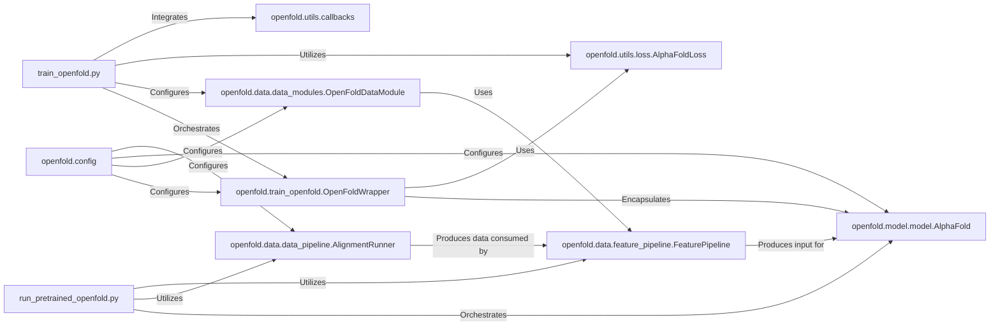

## Details

The Training & Inference Orchestration subsystem in OpenFold is responsible for managing the entire lifecycle of protein structure prediction, from model training to inference. It provides the main entry points and control flow, integrating with PyTorch Lightning for efficient execution and resource management.

### train_openfold.py

This script serves as the primary entry point for initiating and managing the training process. It sets up the PyTorch Lightning Trainer, configures the OpenFoldWrapper, OpenFoldDataModule, loss functions, learning rate schedulers, and various callbacks for monitoring and saving the training progress.

**Related Classes/Methods**:

- <a href="https://github.com/aqlaboratory/openfold/blob/main/train_openfold.py" target="_blank" rel="noopener noreferrer">`train_openfold.py`</a>

### run_pretrained_openfold.py

This script is the main entry point for executing the inference pipeline. It orchestrates the entire prediction workflow, including parsing command-line arguments, loading model configurations and weights, precomputing alignments, generating input features, running the AlphaFold Model, and performing post-processing steps like Amber relaxation.

**Related Classes/Methods**:

- <a href="https://github.com/aqlaboratory/openfold/blob/main/run_pretrained_openfold.py" target="_blank" rel="noopener noreferrer">`run_pretrained_openfold.py`</a>

### openfold.train_openfold.OpenFoldWrapper

This is the core PyTorch Lightning module that encapsulates the AlphaFold Model, defines the forward pass, computes the loss, and manages the training and validation steps. It handles the integration with PyTorch Lightning's training loop, including Exponential Moving Average (EMA) updates and metric logging.

**Related Classes/Methods**:

- <a href="https://github.com/aqlaboratory/openfold/blob/main/train_openfold.py#L44-L268" target="_blank" rel="noopener noreferrer">`openfold.train_openfold.OpenFoldWrapper` (44:268)</a>

### openfold.data.data_modules.OpenFoldDataModule

This PyTorch Lightning DataModule handles the loading, preprocessing, and batching of data specifically for training and validation. It integrates with the DataPipeline and FeaturePipeline to prepare the input features for the model.

**Related Classes/Methods**:

- <a href="https://github.com/aqlaboratory/openfold/blob/main/openfold/data/data_modules.py#L847-L1058" target="_blank" rel="noopener noreferrer">`openfold.data.data_modules.OpenFoldDataModule` (847:1058)</a>

### openfold.utils.loss.AlphaFoldLoss

This class defines the composite loss function used during the training of the AlphaFold Model. It combines various individual loss terms (e.g., FAPE, distogram, masked MSA loss) to guide the model's learning.

**Related Classes/Methods**:

- <a href="https://github.com/aqlaboratory/openfold/blob/main/openfold/utils/loss.py#L1684-L1792" target="_blank" rel="noopener noreferrer">`openfold.utils.loss.AlphaFoldLoss` (1684:1792)</a>

### openfold.config

This centralized module defines all hyperparameters, model architectures, data pipeline settings, and training/inference parameters. It ensures reproducibility and flexibility in experimentation by providing a single source of truth for configuration.

**Related Classes/Methods**:

- <a href="https://github.com/aqlaboratory/openfold/blob/main/openfold/config.py" target="_blank" rel="noopener noreferrer">`openfold.config`</a>

### openfold.data.data_pipeline.AlignmentRunner

Utilized by run_pretrained_openfold.py, this class is responsible for generating Multiple Sequence Alignments (MSAs) and identifying structural templates using external bioinformatics tools.

**Related Classes/Methods**:

- <a href="https://github.com/aqlaboratory/openfold/blob/main/openfold/data/data_pipeline.py#L333-L561" target="_blank" rel="noopener noreferrer">`openfold.data.data_pipeline.AlignmentRunner` (333:561)</a>

### openfold.data.feature_pipeline.FeaturePipeline

This component transforms the raw biological data and generated alignments into the numerical feature dictionaries (tensors) that the AlphaFold Model can directly consume. It is crucial for both training and inference data preparation.

**Related Classes/Methods**:

- <a href="https://github.com/aqlaboratory/openfold/blob/main/openfold/data/feature_pipeline.py#L131-L152" target="_blank" rel="noopener noreferrer">`openfold.data.feature_pipeline.FeaturePipeline` (131:152)</a>

### openfold.model.model.AlphaFold

The core deep learning model responsible for predicting protein structures. It is the central computational engine for both training and inference.

**Related Classes/Methods**:

- <a href="https://github.com/aqlaboratory/openfold/blob/main/openfold/model/model.py#L64-L590" target="_blank" rel="noopener noreferrer">`openfold.model.model.AlphaFold` (64:590)</a>

### openfold.utils.callbacks

This module provides a collection of PyTorch Lightning callbacks, such as EarlyStoppingVerbose and ModelCheckpoint, which are crucial for monitoring training progress, saving model checkpoints, and preventing overfitting.

**Related Classes/Methods**:

- <a href="https://github.com/aqlaboratory/openfold/blob/main/openfold/utils/callbacks.py" target="_blank" rel="noopener noreferrer">`openfold.utils.callbacks`</a>

### [FAQ](https://github.com/CodeBoarding/GeneratedOnBoardings/tree/main?tab=readme-ov-file#faq)