```mermaid

graph LR

    Configuration_Management["Configuration Management"]

    Data_Processing_Pipeline["Data Processing Pipeline"]

    Core_AlphaFold_Model["Core AlphaFold Model"]

    Structure_Post_processing_Utilities["Structure Post-processing & Utilities"]

    Auxiliary_Utilities_Loss_Geometry_["Auxiliary Utilities (Loss & Geometry)"]

    General_System_Utilities["General System Utilities"]

    Training_Inference_Orchestration["Training & Inference Orchestration"]

    Configuration_Management -- "Provides configuration to" --> Data_Processing_Pipeline

    Configuration_Management -- "Provides configuration to" --> Core_AlphaFold_Model

    Configuration_Management -- "Provides configuration to" --> Training_Inference_Orchestration

    Data_Processing_Pipeline -- "Receives configuration from" --> Configuration_Management

    Data_Processing_Pipeline -- "Provides processed features to" --> Core_AlphaFold_Model

    Data_Processing_Pipeline -- "Provides batched data to" --> Training_Inference_Orchestration

    Core_AlphaFold_Model -- "Receives processed features from" --> Data_Processing_Pipeline

    Core_AlphaFold_Model -- "Outputs predictions/structures to" --> Structure_Post_processing_Utilities

    Core_AlphaFold_Model -- "Outputs intermediate representations for" --> Auxiliary_Utilities_Loss_Geometry_

    Core_AlphaFold_Model -- "Receives configuration from" --> Configuration_Management

    Structure_Post_processing_Utilities -- "Receives predicted structures from" --> Core_AlphaFold_Model

    Structure_Post_processing_Utilities -- "Provides refined structures to" --> Training_Inference_Orchestration

    Structure_Post_processing_Utilities -- "Utilizes" --> Auxiliary_Utilities_Loss_Geometry_

    Auxiliary_Utilities_Loss_Geometry_ -- "Receives predictions/intermediate representations from" --> Core_AlphaFold_Model

    Auxiliary_Utilities_Loss_Geometry_ -- "Provides computed loss values to" --> Training_Inference_Orchestration

    Auxiliary_Utilities_Loss_Geometry_ -- "Utilized by" --> Structure_Post_processing_Utilities

    General_System_Utilities -- "Provides functionalities to" --> Training_Inference_Orchestration

    General_System_Utilities -- "Provides functionalities to" --> Core_AlphaFold_Model

    Training_Inference_Orchestration -- "Receives configuration from" --> Configuration_Management

    Training_Inference_Orchestration -- "Initiates and manages" --> Data_Processing_Pipeline

    Training_Inference_Orchestration -- "Executes" --> Core_AlphaFold_Model

    Training_Inference_Orchestration -- "Receives loss values from" --> Auxiliary_Utilities_Loss_Geometry_

    Training_Inference_Orchestration -- "Receives refined structures from" --> Structure_Post_processing_Utilities

    Training_Inference_Orchestration -- "Leverages" --> General_System_Utilities

    click Configuration_Management href "https://github.com/aqlaboratory/openfold/blob/main/.codeboarding//Configuration_Management.md" "Details"

    click Data_Processing_Pipeline href "https://github.com/aqlaboratory/openfold/blob/main/.codeboarding//Data_Processing_Pipeline.md" "Details"

    click Core_AlphaFold_Model href "https://github.com/aqlaboratory/openfold/blob/main/.codeboarding//Core_AlphaFold_Model.md" "Details"

    click Auxiliary_Utilities_Loss_Geometry_ href "https://github.com/aqlaboratory/openfold/blob/main/.codeboarding//Auxiliary_Utilities_Loss_Geometry_.md" "Details"

    click Training_Inference_Orchestration href "https://github.com/aqlaboratory/openfold/blob/main/.codeboarding//Training_Inference_Orchestration.md" "Details"

```

## Details

The `openfold` project, a research-oriented deep learning framework for protein structure prediction, exhibits a modular and configuration-driven architecture. The core data flow revolves around preparing biological sequence data, feeding it into a sophisticated deep learning model, and then post-processing the predicted structures.

### Configuration Management [[Expand]](./Configuration_Management.md)

Centralized system for defining, loading, and managing all configurable parameters for the model, data pipelines, and training/inference processes. It ensures consistency and flexibility across different experimental setups.

**Related Classes/Methods**:

- <a href="https://github.com/aqlaboratory/openfold/blob/main/openfold/config.py" target="_blank" rel="noopener noreferrer">`openfold/config.py`</a>

### Data Processing Pipeline [[Expand]](./Data_Processing_Pipeline.md)

Manages the entire lifecycle of input data, from raw sequences and external tool outputs (e.g., MSAs, templates) to model-ready features. This includes interfacing with bioinformatics tools, parsing various data formats, applying complex transformations, and preparing data batches for efficient model consumption.

**Related Classes/Methods**:

- `openfold/data/tools/`

- <a href="https://github.com/aqlaboratory/openfold/blob/main/openfold/data/parsers.py" target="_blank" rel="noopener noreferrer">`openfold/data/parsers.py`</a>

- <a href="https://github.com/aqlaboratory/openfold/blob/main/openfold/data/data_pipeline.py" target="_blank" rel="noopener noreferrer">`openfold/data/data_pipeline.py`</a>

- <a href="https://github.com/aqlaboratory/openfold/blob/main/openfold/data/feature_pipeline.py" target="_blank" rel="noopener noreferrer">`openfold/data/feature_pipeline.py`</a>

- <a href="https://github.com/aqlaboratory/openfold/blob/main/openfold/data/data_transforms.py" target="_blank" rel="noopener noreferrer">`openfold/data/data_transforms.py`</a>

- <a href="https://github.com/aqlaboratory/openfold/blob/main/openfold/data/data_modules.py" target="_blank" rel="noopener noreferrer">`openfold/data/data_modules.py`</a>

- <a href="https://github.com/aqlaboratory/openfold/blob/main/openfold/data/input_pipeline.py" target="_blank" rel="noopener noreferrer">`openfold/data/input_pipeline.py`</a>

- <a href="https://github.com/aqlaboratory/openfold/blob/main/openfold/data/msa_pairing.py" target="_blank" rel="noopener noreferrer">`openfold/data/msa_pairing.py`</a>

- <a href="https://github.com/aqlaboratory/openfold/blob/main/openfold/data/templates.py" target="_blank" rel="noopener noreferrer">`openfold/data/templates.py`</a>

- <a href="https://github.com/aqlaboratory/openfold/blob/main/openfold/data/mmcif_parsing.py" target="_blank" rel="noopener noreferrer">`openfold/data/mmcif_parsing.py`</a>

- <a href="https://github.com/aqlaboratory/openfold/blob/main/openfold/data/data_transforms_multimer.py" target="_blank" rel="noopener noreferrer">`openfold/data/data_transforms_multimer.py`</a>

- <a href="https://github.com/aqlaboratory/openfold/blob/main/openfold/data/feature_processing_multimer.py" target="_blank" rel="noopener noreferrer">`openfold/data/feature_processing_multimer.py`</a>

- <a href="https://github.com/aqlaboratory/openfold/blob/main/openfold/data/input_pipeline_multimer.py" target="_blank" rel="noopener noreferrer">`openfold/data/input_pipeline_multimer.py`</a>

### Core AlphaFold Model [[Expand]](./Core_AlphaFold_Model.md)

The primary deep learning model responsible for predicting protein structures. It orchestrates its internal sub-modules (Embedders, Evoformer, Structure Module, Prediction Heads) and fundamental primitives to process input features and generate structural outputs.

**Related Classes/Methods**:

- <a href="https://github.com/aqlaboratory/openfold/blob/main/openfold/model/model.py" target="_blank" rel="noopener noreferrer">`openfold/model/model.py`</a>

- <a href="https://github.com/aqlaboratory/openfold/blob/main/openfold/model/embedders.py" target="_blank" rel="noopener noreferrer">`openfold/model/embedders.py`</a>

- <a href="https://github.com/aqlaboratory/openfold/blob/main/openfold/model/evoformer.py" target="_blank" rel="noopener noreferrer">`openfold/model/evoformer.py`</a>

- <a href="https://github.com/aqlaboratory/openfold/blob/main/openfold/model/structure_module.py" target="_blank" rel="noopener noreferrer">`openfold/model/structure_module.py`</a>

- <a href="https://github.com/aqlaboratory/openfold/blob/main/openfold/model/heads.py" target="_blank" rel="noopener noreferrer">`openfold/model/heads.py`</a>

- <a href="https://github.com/aqlaboratory/openfold/blob/main/openfold/model/primitives.py" target="_blank" rel="noopener noreferrer">`openfold/model/primitives.py`</a>

- <a href="https://github.com/aqlaboratory/openfold/blob/main/openfold/model/dropout.py" target="_blank" rel="noopener noreferrer">`openfold/model/dropout.py`</a>

- <a href="https://github.com/aqlaboratory/openfold/blob/main/openfold/model/msa.py" target="_blank" rel="noopener noreferrer">`openfold/model/msa.py`</a>

- <a href="https://github.com/aqlaboratory/openfold/blob/main/openfold/model/outer_product_mean.py" target="_blank" rel="noopener noreferrer">`openfold/model/outer_product_mean.py`</a>

- <a href="https://github.com/aqlaboratory/openfold/blob/main/openfold/model/pair_transition.py" target="_blank" rel="noopener noreferrer">`openfold/model/pair_transition.py`</a>

- <a href="https://github.com/aqlaboratory/openfold/blob/main/openfold/model/template.py" target="_blank" rel="noopener noreferrer">`openfold/model/template.py`</a>

- <a href="https://github.com/aqlaboratory/openfold/blob/main/openfold/model/triangular_attention.py" target="_blank" rel="noopener noreferrer">`openfold/model/triangular_attention.py`</a>

- <a href="https://github.com/aqlaboratory/openfold/blob/main/openfold/model/triangular_multiplicative_update.py" target="_blank" rel="noopener noreferrer">`openfold/model/triangular_multiplicative_update.py`</a>

### Structure Post-processing & Utilities

Provides NumPy-based utilities for handling protein structures (e.g., PDB/ModelCIF conversion, atom mask generation) and integrates molecular mechanics (Amber minimization) for refining predicted structures to improve geometry and resolve clashes.

**Related Classes/Methods**:

- <a href="https://github.com/aqlaboratory/openfold/blob/main/openfold/np/protein.py" target="_blank" rel="noopener noreferrer">`openfold/np/protein.py`</a>

- <a href="https://github.com/aqlaboratory/openfold/blob/main/openfold/np/residue_constants.py" target="_blank" rel="noopener noreferrer">`openfold/np/residue_constants.py`</a>

- `openfold/np/relax/`

### Auxiliary Utilities (Loss & Geometry) [[Expand]](./Auxiliary_Utilities_Loss_Geometry_.md)

Implements various loss components crucial for training the AlphaFold model and provides fundamental operations for 3D geometry, rigid body transformations, and all-atom coordinate manipulations, essential for protein structure representation and calculations.

**Related Classes/Methods**:

- <a href="https://github.com/aqlaboratory/openfold/blob/main/openfold/utils/loss.py" target="_blank" rel="noopener noreferrer">`openfold/utils/loss.py`</a>

- `openfold/utils/geometry/`

- <a href="https://github.com/aqlaboratory/openfold/blob/main/openfold/utils/rigid_utils.py" target="_blank" rel="noopener noreferrer">`openfold/utils/rigid_utils.py`</a>

- <a href="https://github.com/aqlaboratory/openfold/blob/main/openfold/utils/all_atom_multimer.py" target="_blank" rel="noopener noreferrer">`openfold/utils/all_atom_multimer.py`</a>

### General System Utilities

A collection of miscellaneous helper functions and modules that support various aspects of the framework, including learning rate scheduling, callbacks, model weight management (EMA, checkpointing, loading), memory optimization (chunking), mixed precision handling, and command-line argument parsing.

**Related Classes/Methods**:

- <a href="https://github.com/aqlaboratory/openfold/blob/main/openfold/utils/exponential_moving_average.py" target="_blank" rel="noopener noreferrer">`openfold/utils/exponential_moving_average.py`</a>

- <a href="https://github.com/aqlaboratory/openfold/blob/main/openfold/utils/lr_schedulers.py" target="_blank" rel="noopener noreferrer">`openfold/utils/lr_schedulers.py`</a>

- <a href="https://github.com/aqlaboratory/openfold/blob/main/openfold/utils/callbacks.py" target="_blank" rel="noopener noreferrer">`openfold/utils/callbacks.py`</a>

- <a href="https://github.com/aqlaboratory/openfold/blob/main/openfold/utils/logger.py" target="_blank" rel="noopener noreferrer">`openfold/utils/logger.py`</a>

- <a href="https://github.com/aqlaboratory/openfold/blob/main/openfold/utils/multi_chain_permutation.py" target="_blank" rel="noopener noreferrer">`openfold/utils/multi_chain_permutation.py`</a>

- <a href="https://github.com/aqlaboratory/openfold/blob/main/openfold/utils/import_weights.py" target="_blank" rel="noopener noreferrer">`openfold/utils/import_weights.py`</a>

- <a href="https://github.com/aqlaboratory/openfold/blob/main/openfold/utils/checkpointing.py" target="_blank" rel="noopener noreferrer">`openfold/utils/checkpointing.py`</a>

- <a href="https://github.com/aqlaboratory/openfold/blob/main/openfold/utils/chunk_utils.py" target="_blank" rel="noopener noreferrer">`openfold/utils/chunk_utils.py`</a>

- <a href="https://github.com/aqlaboratory/openfold/blob/main/openfold/utils/precision_utils.py" target="_blank" rel="noopener noreferrer">`openfold/utils/precision_utils.py`</a>

- <a href="https://github.com/aqlaboratory/openfold/blob/main/openfold/utils/tensor_utils.py" target="_blank" rel="noopener noreferrer">`openfold/utils/tensor_utils.py`</a>

- <a href="https://github.com/aqlaboratory/openfold/blob/main/openfold/utils/trace_utils.py" target="_blank" rel="noopener noreferrer">`openfold/utils/trace_utils.py`</a>

- <a href="https://github.com/aqlaboratory/openfold/blob/main/openfold/utils/script_utils.py" target="_blank" rel="noopener noreferrer">`openfold/utils/script_utils.py`</a>

- <a href="https://github.com/aqlaboratory/openfold/blob/main/openfold/utils/argparse_utils.py" target="_blank" rel="noopener noreferrer">`openfold/utils/argparse_utils.py`</a>

### Training & Inference Orchestration [[Expand]](./Training_Inference_Orchestration.md)

The main entry points and control flow for executing training and inference tasks. It integrates with PyTorch Lightning, manages the training loop, optimizers, logging, model loading, and output saving.

**Related Classes/Methods**:

- <a href="https://github.com/aqlaboratory/openfold/blob/main/train_openfold.py" target="_blank" rel="noopener noreferrer">`train_openfold.py`</a>

- <a href="https://github.com/aqlaboratory/openfold/blob/main/run_pretrained_openfold.py" target="_blank" rel="noopener noreferrer">`run_pretrained_openfold.py`</a>

### [FAQ](https://github.com/CodeBoarding/GeneratedOnBoardings/tree/main?tab=readme-ov-file#faq)