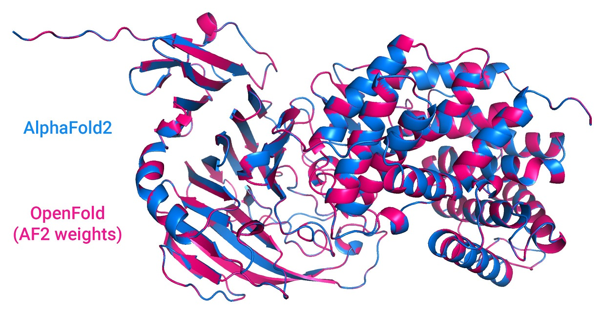

# OpenFold

A faithful PyTorch reproduction of DeepMind's 
[AlphaFold 2](https://github.com/deepmind/alphafold).

## Features

OpenFold carefully reproduces (almost) all of the features of the original open
source inference code (v2.0.1). The sole exception is model ensembling, which 
fared poorly in DeepMind's own ablation testing and is being phased out in future
DeepMind experiments. It is omitted here for the sake of reducing clutter. In 
cases where the *Nature* paper differs from the source, we always defer to the 
latter. 

OpenFold is built to support inference with AlphaFold's original JAX weights.
Try it out with our [Colab notebook](https://colab.research.google.com/github/aqlaboratory/openfold/blob/main/notebooks/OpenFold.ipynb).

Unlike DeepMind's public code, OpenFold is also trainable. It can be trained 
with [DeepSpeed](https://github.com/microsoft/deepspeed) and with either `fp16`
or `bfloat16` half-precision.

## Installation (Linux)

All Python dependencies are specified in `environment.yml`. For producing sequence 
alignments, you'll also need `kalign`, the [HH-suite](https://github.com/soedinglab/hh-suite), 
and one of {`jackhmmer`, [MMseqs2](https://github.com/soedinglab/mmseqs2) (nightly build)} 
installed on on your system. Finally, some download scripts require `aria2c`.

For convenience, we provide a script that installs Miniconda locally, creates a 
`conda` virtual environment, installs all Python dependencies, and downloads
useful resources (including DeepMind's pretrained parameters). Run:

```bash
scripts/install_third_party_dependencies.sh
```

To activate the environment, run:

```bash
source scripts/activate_conda_env.sh
```

To deactivate it, run:

```bash
source scripts/deactivate_conda_env.sh
```

To install the HH-suite to `/usr/bin`, run

```bash
# scripts/install_hh_suite.sh
```

## Usage

To download DeepMind's pretrained parameters and common ground truth data, run:

```bash
bash scripts/download_data.sh data/
```

You have two choices for downloading protein databases, depending on whether 
you want to use DeepMind's MSA generation pipeline (w/ HMMR & HHblits) or 
[ColabFold](https://github.com/sokrypton/ColabFold)'s, which uses the faster
MMseqs2 instead. For the former, run:

```bash
bash scripts/download_alphafold_dbs.sh data/
```

For the latter, run:

```bash
bash scripts/download_mmseqs_dbs.sh data/    # downloads .tar files
bash scripts/prep_mmseqs_dbs.sh data/        # unpacks and preps the databases
```

Make sure to run the latter command on the machine that will be used for MSA
generation (the script estimates how the precomputed database index used by
MMseqs2 should be split according to the memory available on the system).

Alternatively, you can use raw MSAs from 
[ProteinNet](https://github.com/aqlaboratory/proteinnet). After downloading
the database, use `scripts/prep_proteinnet_msas.py` to convert the data into
a format recognized by the OpenFold parser. The resulting directory becomes the
`alignment_dir` used in subsequent steps. Use `scripts/unpack_proteinnet.py` to
extract `.core` files from ProteinNet text files.

For both inference and training, the model's hyperparameters can be tuned from
`openfold/config.py`. Of course, if you plan to perform inference using 
DeepMind's pretrained parameters, you will only be able to make changes that
do not affect the shapes of model parameters. For an example of initializing
the model, consult `run_pretrained_openfold.py`.

### Inference

To run inference on a sequence or multiple sequences using a set of DeepMind's 
pretrained parameters, run e.g.:

```bash
python3 run_pretrained_openfold.py \
    target.fasta \
    data/uniref90/uniref90.fasta \
    data/mgnify/mgy_clusters_2018_12.fa \
    data/pdb70/pdb70 \
    data/pdb_mmcif/mmcif_files/ \
    data/uniclust30/uniclust30_2018_08/uniclust30_2018_08 \
    --output_dir ./ \
    --bfd_database_path data/bfd/bfd_metaclust_clu_complete_id30_c90_final_seq.sorted_opt \
    --model_device cuda:1 \
    --jackhmmer_binary_path lib/conda/envs/openfold_venv/bin/jackhmmer \
    --hhblits_binary_path lib/conda/envs/openfold_venv/bin/hhblits \
    --hhsearch_binary_path lib/conda/envs/openfold_venv/bin/hhsearch \
    --kalign_binary_path lib/conda/envs/openfold_venv/bin/kalign
```

where `data` is the same directory as in the previous step. If `jackhmmer`, 
`hhblits`, `hhsearch` and `kalign` are available at the default path of 
`/usr/bin`, their `binary_path` command-line arguments can be dropped.
If you've already computed alignments for the query, you have the option to 
circumvent the expensive alignment computation here.

Note that chunking (as defined in section 1.11.8 of the AlphaFold 2 supplement)
is enabled by default in inference mode. To disable it, set `globals.chunk_size`
to `None` in the config.

### Training

After activating the OpenFold environment with 
`source scripts/activate_conda_env.sh`, install OpenFold by running

```bash
python setup.py install
```

To train the model, you will first need to precompute protein alignments. 

You have two options. You can use the same procedure DeepMind used by running
the following:

```bash
python3 scripts/precompute_alignments.py mmcif_dir/ alignment_dir/ \
    data/uniref90/uniref90.fasta \
    data/mgnify/mgy_clusters_2018_12.fa \
    data/pdb70/pdb70 \
    data/pdb_mmcif/mmcif_files/ \
    data/uniclust30/uniclust30_2018_08/uniclust30_2018_08 \
    --bfd_database_path data/bfd/bfd_metaclust_clu_complete_id30_c90_final_seq.sorted_opt \
    --cpus 16 \
    --jackhmmer_binary_path lib/conda/envs/openfold_venv/bin/jackhmmer \
    --hhblits_binary_path lib/conda/envs/openfold_venv/bin/hhblits \
    --hhsearch_binary_path lib/conda/envs/openfold_venv/bin/hhsearch \
    --kalign_binary_path lib/conda/envs/openfold_venv/bin/kalign
```

As noted before, you can skip the `binary_path` arguments if these binaries are 
at `/usr/bin`. Expect this step to take a very long time, even for small 
numbers of proteins.

Alternatively, you can generate MSAs with the ColabFold pipeline (and templates
with HHsearch) with:

```bash
python3 scripts/precompute_alignments_mmseqs.py input.fasta \
    data/mmseqs_dbs \
    uniref30_2103_db \
    alignment_dir \
    ~/MMseqs2/build/bin/mmseqs \
    /usr/bin/hhsearch \
    --env_db colabfold_envdb_202108_db
    --pdb70 data/pdb70/pdb70
```

where `input.fasta` is a FASTA file containing one or more query sequences. To 
generate an input FASTA from a directory of mmCIF and/or ProteinNet .core 
files, we provide `scripts/data_dir_to_fasta.py`.

Next, generate a cache of certain datapoints in the mmCIF files:

```bash
python3 scripts/generate_mmcif_cache.py \
    mmcif_dir/ \
    mmcif_cache.json \
    --no_workers 16
```

This cache is used to minimize the number of mmCIF parses performed during 
training-time data preprocessing. Finally, call the training script:

```bash
python3 train_openfold.py mmcif_dir/ alignment_dir/ template_mmcif_dir/ \
    2021-10-10 \ 
    --template_release_dates_cache_path mmcif_cache.json \ 
    --precision 16 \
    --gpus 8 --replace_sampler_ddp=True \
    --seed 42 \ # in multi-gpu settings, the seed must be specified
    --deepspeed_config_path deepspeed_config.json \
    --resume_from_ckpt ckpt_dir/
```

where `--template_release_dates_cache_path` is a path to the `.json` file
generated in the previous step. A suitable DeepSpeed configuration file can be 
generated with `scripts/build_deepspeed_config.py`. The training script is 
written with [PyTorch Lightning](https://github.com/PyTorchLightning/pytorch-lightning) 
and supports the full range of training options that entails, including 
multi-node distributed training. For more information, consult PyTorch 
Lightning documentation and the `--help` flag of the training script.

Note that the data directory can also contain PDB files previously output by
the model. These are treated as members of the self-distillation set and are
subjected to distillation-set-only preprocessing steps.

## Testing

To run unit tests, use

```bash
scripts/run_unit_tests.sh
```

The script is a thin wrapper around Python's `unittest` suite, and recognizes
`unittest` arguments. E.g., to run a specific test verbosely:

```bash
scripts/run_unit_tests.sh -v tests.test_model
```

Certain tests require that AlphaFold (v2.0.1) be installed in the same Python
environment. These run components of AlphaFold and OpenFold side by side and
ensure that output activations are adequately similar. For most modules, we
target a maximum pointwise difference of `1e-4`.

## Copyright notice

While AlphaFold's and, by extension, OpenFold's source code is licensed under
the permissive Apache Licence, Version 2.0, DeepMind's pretrained parameters 
remain under the more restrictive CC BY-NC 4.0 license, a copy of which is 
downloaded to `openfold/resources/params` by the installation script. They are
thereby made unavailable for commercial use.

## Contributing

If you encounter problems using OpenFold, feel free to create an issue! We also
welcome pull requests from the community.

## Citing this work

For now, cite OpenFold as follows:

```bibtex
@software{Ahdritz_OpenFold_2021,
  author = {Ahdritz, Gustaf and Bouatta, Nazim and Kadyan, Sachin and Xia, Qinghui and Gerecke, William and AlQuraishi, Mohammed},
  doi = {10.5281/zenodo.5709539},
  month = {11},
  title = {{OpenFold}},
  url = {https://github.com/aqlaboratory/openfold},
  year = {2021}
}
```

Any work that cites OpenFold should also cite AlphaFold.
