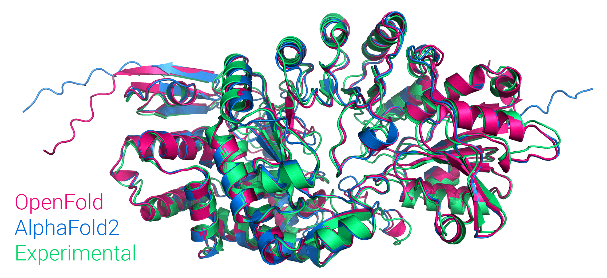

_Figure: Comparison of OpenFold and AlphaFold2 predictions to the experimental structure of PDB 7KDX, chain B._


# OpenFold

A faithful but trainable PyTorch reproduction of DeepMind's 
[AlphaFold 2](https://github.com/deepmind/alphafold).

## Features

OpenFold carefully reproduces (almost) all of the features of the original open
source inference code (v2.0.1). The sole exception is model ensembling, which 
fared poorly in DeepMind's own ablation testing and is being phased out in future
DeepMind experiments. It is omitted here for the sake of reducing clutter. In 
cases where the *Nature* paper differs from the source, we always defer to the 
latter.

OpenFold is trainable in full precision or `bfloat16` with or without DeepSpeed, 
and we've trained it from scratch, matching the performance of the original. 
We've publicly released model weights and our training data &mdash; some 400,000 
MSAs and PDB70 template hit files &mdash; under a permissive license. Model weights 
are available via scripts in this repository while the MSAs are hosted by the 
[Registry of Open Data on AWS (RODA)](https://registry.opendata.aws/openfold). 
Try out running inference for yourself with our [Colab notebook](https://colab.research.google.com/github/aqlaboratory/openfold/blob/main/notebooks/OpenFold.ipynb).

OpenFold also supports inference using AlphaFold's official parameters, and 
vice versa (see `scripts/convert_of_weights_to_jax.py`).

OpenFold has the following advantages over the reference implementation:

- **Faster inference** on GPU, sometimes by as much as 2x. The greatest speedups are achieved on (>= Ampere) GPUs.
- **Inference on extremely long chains**, made possible by our implementation of low-memory attention 
([Rabe & Staats 2021](https://arxiv.org/pdf/2112.05682.pdf)). OpenFold can predict the structures of
  sequences with more than 4000 residues on a single A100, and even longer ones with CPU offloading.
- **Custom CUDA attention kernels** modified from [FastFold](https://github.com/hpcaitech/FastFold)'s 
kernels support in-place attention during inference and training. They use 
4x and 5x less GPU memory than equivalent FastFold and stock PyTorch 
implementations, respectively.
- **Efficient alignment scripts** using the original AlphaFold HHblits/JackHMMER pipeline or [ColabFold](https://github.com/sokrypton/ColabFold)'s, which uses the faster MMseqs2 instead. We've used them to generate millions of alignments.
- **FlashAttention** support greatly speeds up MSA attention.

## Installation (Linux)

All Python dependencies are specified in `environment.yml`. For producing sequence 
alignments, you'll also need `kalign`, the [HH-suite](https://github.com/soedinglab/hh-suite), 
and one of {`jackhmmer`, [MMseqs2](https://github.com/soedinglab/mmseqs2) (nightly build)} 
installed on on your system. You'll need `git-lfs` to download OpenFold parameters. 
Finally, some download scripts require `aria2c` and `aws`.

For convenience, we provide a script that installs Miniconda locally, creates a 
`conda` virtual environment, installs all Python dependencies, and downloads
useful resources, including both sets of model parameters. Run:

```bash
scripts/install_third_party_dependencies.sh
```

To activate the environment, run:

```bash
source scripts/activate_conda_env.sh
```

To deactivate it, run:

```bash
source scripts/deactivate_conda_env.sh
```

With the environment active, compile OpenFold's CUDA kernels with

```bash
python3 setup.py install
```

To install the HH-suite to `/usr/bin`, run

```bash
# scripts/install_hh_suite.sh
```

## Usage

To download the databases used to train OpenFold and AlphaFold run:

```bash
bash scripts/download_data.sh data/
```

You have two choices for downloading protein databases, depending on whether 
you want to use DeepMind's MSA generation pipeline (w/ HMMR & HHblits) or 
[ColabFold](https://github.com/sokrypton/ColabFold)'s, which uses the faster
MMseqs2 instead. For the former, run:

```bash
bash scripts/download_alphafold_dbs.sh data/
```

For the latter, run:

```bash
bash scripts/download_mmseqs_dbs.sh data/    # downloads .tar files
bash scripts/prep_mmseqs_dbs.sh data/        # unpacks and preps the databases
```

Make sure to run the latter command on the machine that will be used for MSA
generation (the script estimates how the precomputed database index used by
MMseqs2 should be split according to the memory available on the system).

Alternatively, you can use raw MSAs from our aforementioned MSA database or
[ProteinNet](https://github.com/aqlaboratory/proteinnet). After downloading
the latter database, use `scripts/prep_proteinnet_msas.py` to convert the data 
into a format recognized by the OpenFold parser. The resulting directory 
becomes the `alignment_dir` used in subsequent steps. Use 
`scripts/unpack_proteinnet.py` to extract `.core` files from ProteinNet text 
files.

For both inference and training, the model's hyperparameters can be tuned from
`openfold/config.py`. Of course, if you plan to perform inference using 
DeepMind's pretrained parameters, you will only be able to make changes that
do not affect the shapes of model parameters. For an example of initializing
the model, consult `run_pretrained_openfold.py`.

### Inference

To run inference on a sequence or multiple sequences using a set of DeepMind's 
pretrained parameters, run e.g.:

```bash
python3 run_pretrained_openfold.py \
    fasta_dir \
    data/pdb_mmcif/mmcif_files/ \
    --uniref90_database_path data/uniref90/uniref90.fasta \
    --mgnify_database_path data/mgnify/mgy_clusters_2018_12.fa \
    --pdb70_database_path data/pdb70/pdb70 \
    --uniclust30_database_path data/uniclust30/uniclust30_2018_08/uniclust30_2018_08 \
    --output_dir ./ \
    --bfd_database_path data/bfd/bfd_metaclust_clu_complete_id30_c90_final_seq.sorted_opt \
    --model_device "cuda:0" \
    --jackhmmer_binary_path lib/conda/envs/openfold_venv/bin/jackhmmer \
    --hhblits_binary_path lib/conda/envs/openfold_venv/bin/hhblits \
    --hhsearch_binary_path lib/conda/envs/openfold_venv/bin/hhsearch \
    --kalign_binary_path lib/conda/envs/openfold_venv/bin/kalign \
    --config_preset "model_1_ptm" \
    --openfold_checkpoint_path openfold/resources/openfold_params/finetuning_ptm_2.pt
```

where `data` is the same directory as in the previous step. If `jackhmmer`, 
`hhblits`, `hhsearch` and `kalign` are available at the default path of 
`/usr/bin`, their `binary_path` command-line arguments can be dropped.
If you've already computed alignments for the query, you have the option to 
skip the expensive alignment computation here with 
`--use_precomputed_alignments`.

`--openfold_checkpoint_path` or `--jax_param_path` accept comma-delineated lists
of .pt/DeepSpeed OpenFold checkpoints and AlphaFold's .npz JAX parameter files, 
respectively. For a breakdown of the differences between the different parameter 
files, see the README downloaded to `openfold/resources/openfold_params/`. Since 
OpenFold was trained under a newer training schedule than the one from which the 
`model_n` config presets are derived, there is no clean correspondence between 
`config_preset` settings and OpenFold checkpoints; the only restraints are that 
`*_ptm` checkpoints must be run with `*_ptm` config presets and that `_no_templ_`
checkpoints are only compatible with template-less presets (`model_3` and above).

Note that chunking (as defined in section 1.11.8 of the AlphaFold 2 supplement)
is enabled by default in inference mode. To disable it, set `globals.chunk_size`
to `None` in the config. If a value is specified, OpenFold will attempt to 
dynamically tune it, considering the chunk size specified in the config as a 
minimum. This tuning process automatically ensures consistently fast runtimes 
regardless of input sequence length, but it also introduces some runtime 
variability, which may be undesirable for certain users. It is also recommended
to disable this feature for very long chains (see below). To do so, set the 
`tune_chunk_size` option in the config to `False`.

For large-scale batch inference, we offer an optional tracing mode, which
massively improves runtimes at the cost of a lengthy model compilation process.
To enable it, add `--trace_model` to the inference command.

To get a speedup during inference, enable [FlashAttention](https://github.com/HazyResearch/flash-attention)
in the config. Note that it appears to work best for sequences with < 1000 residues.

Input FASTA files containing multiple sequences are treated as complexes. In
this case, the inference script runs AlphaFold-Gap, a hack proposed
[here](https://twitter.com/minkbaek/status/1417538291709071362?lang=en), using
the specified stock AlphaFold/OpenFold parameters (NOT AlphaFold-Multimer). To
run inference with AlphaFold-Multimer, use the (experimental) `multimer` branch 
instead.

To minimize memory usage during inference on long sequences, consider the
following changes:

- As noted in the AlphaFold-Multimer paper, the AlphaFold/OpenFold template
stack is a major memory bottleneck for inference on long sequences. OpenFold
supports two mutually exclusive inference modes to address this issue. One,
`average_templates` in the `template` section of the config, is similar to the
solution offered by AlphaFold-Multimer, which is simply to average individual
template representations. Our version is modified slightly to accommodate 
weights trained using the standard template algorithm. Using said weights, we
notice no significant difference in performance between our averaged template 
embeddings and the standard ones. The second, `offload_templates`, temporarily 
offloads individual template embeddings into CPU memory. The former is an 
approximation while the latter is slightly slower; both are memory-efficient 
and allow the model to utilize arbitrarily many templates across sequence 
lengths. Both are disabled by default, and it is up to the user to determine 
which best suits their needs, if either.
- Inference-time low-memory attention (LMA) can be enabled in the model config.
This setting trades off speed for vastly improved memory usage. By default,
LMA is run with query and key chunk sizes of 1024 and 4096, respectively.
These represent a favorable tradeoff in most memory-constrained cases.
Powerusers can choose to tweak these settings in 
`openfold/model/primitives.py`. For more information on the LMA algorithm,
see the aforementioned Staats & Rabe preprint.
- Disable `tune_chunk_size` for long sequences. Past a certain point, it only
wastes time.
- As a last resort, consider enabling `offload_inference`. This enables more
extensive CPU offloading at various bottlenecks throughout the model.
- Disable FlashAttention, which seems unstable on long sequences.

Using the most conservative settings, we were able to run inference on a 
4600-residue complex with a single A100. Compared to AlphaFold's own memory 
offloading mode, ours is considerably faster; the same complex takes the more 
efficent AlphaFold-Multimer more than double the time. Use the
`long_sequence_inference` config option to enable all of these interventions
at once.

### Training

To train the model, you will first need to precompute protein alignments. 

You have two options. You can use the same procedure DeepMind used by running
the following:

```bash
python3 scripts/precompute_alignments.py mmcif_dir/ alignment_dir/ \
    --uniref90_database_path data/uniref90/uniref90.fasta \
    --mgnify_database_path data/mgnify/mgy_clusters_2018_12.fa \
    --pdb70_database_path data/pdb70/pdb70 \
    --uniclust30_database_path data/uniclust30/uniclust30_2018_08/uniclust30_2018_08 \
    --bfd_database_path data/bfd/bfd_metaclust_clu_complete_id30_c90_final_seq.sorted_opt \
    --cpus 16 \
    --jackhmmer_binary_path lib/conda/envs/openfold_venv/bin/jackhmmer \
    --hhblits_binary_path lib/conda/envs/openfold_venv/bin/hhblits \
    --hhsearch_binary_path lib/conda/envs/openfold_venv/bin/hhsearch \
    --kalign_binary_path lib/conda/envs/openfold_venv/bin/kalign
```

As noted before, you can skip the `binary_path` arguments if these binaries are 
at `/usr/bin`. Expect this step to take a very long time, even for small 
numbers of proteins.

Alternatively, you can generate MSAs with the ColabFold pipeline (and templates
with HHsearch) with:

```bash
python3 scripts/precompute_alignments_mmseqs.py input.fasta \
    data/mmseqs_dbs \
    uniref30_2103_db \
    alignment_dir \
    ~/MMseqs2/build/bin/mmseqs \
    /usr/bin/hhsearch \
    --env_db colabfold_envdb_202108_db
    --pdb70 data/pdb70/pdb70
```

where `input.fasta` is a FASTA file containing one or more query sequences. To 
generate an input FASTA from a directory of mmCIF and/or ProteinNet .core 
files, we provide `scripts/data_dir_to_fasta.py`.

Next, generate a cache of certain datapoints in the template mmCIF files:

```bash
python3 scripts/generate_mmcif_cache.py \
    mmcif_dir/ \
    mmcif_cache.json \
    --no_workers 16
```

This cache is used to pre-filter templates. 

Next, generate a separate chain-level cache with data used for training-time 
data filtering:

```bash
python3 scripts/generate_chain_data_cache.py \
    mmcif_dir/ \
    chain_data_cache.json \
    --cluster_file clusters-by-entity-40.txt \
    --no_workers 16
```

where the `cluster_file` argument is a file of chain clusters, one cluster
per line (e.g. [PDB40](https://cdn.rcsb.org/resources/sequence/clusters/clusters-by-entity-40.txt)).

Optionally, download an AlphaFold-style validation set from 
[CAMEO](https://cameo3d.org) using `scripts/download_cameo.py`. Use the 
resulting FASTA files to generate validation alignments and then specify 
the validation set's location using the `--val_...` family of training script 
flags.

Finally, call the training script:

```bash
python3 train_openfold.py mmcif_dir/ alignment_dir/ template_mmcif_dir/ output_dir/ \
    2021-10-10 \ 
    --template_release_dates_cache_path mmcif_cache.json \ 
    --precision bf16 \
    --gpus 8 --replace_sampler_ddp=True \
    --seed 4242022 \ # in multi-gpu settings, the seed must be specified
    --deepspeed_config_path deepspeed_config.json \
    --checkpoint_every_epoch \
    --resume_from_ckpt ckpt_dir/ \
    --train_chain_data_cache_path chain_data_cache.json \
    --obsolete_pdbs_file_path obsolete.dat
```

where `--template_release_dates_cache_path` is a path to the mmCIF cache. 
Note that `template_mmcif_dir` can be the same as `mmcif_dir` which contains
training targets. A suitable DeepSpeed configuration file can be generated with 
`scripts/build_deepspeed_config.py`. The training script is 
written with [PyTorch Lightning](https://github.com/PyTorchLightning/pytorch-lightning) 
and supports the full range of training options that entails, including 
multi-node distributed training, validation, and so on. For more information, 
consult PyTorch Lightning documentation and the `--help` flag of the training 
script.

If you're using your own MSAs or MSAs from the RODA repository, make sure that
the `alignment_dir` contains one directory per chain and that each of these
contains alignments (.sto, .a3m, and .hhr) corresponding to that chain. You
can use `scripts/flatten_roda.sh` to reformat RODA downloads in this way.

Note that, despite its variable name, `mmcif_dir` can also contain PDB files 
or even ProteinNet .core files. To emulate the AlphaFold training procedure, 
which uses a self-distillation set subject to special preprocessing steps, use
the family of `--distillation` flags.

In cases where it may be burdensome to create separate files for each chain's
alignments, alignment directories can be consolidated using the scripts in 
`scripts/alignment_db_scripts/`. First, run `create_alignment_db.py` to
consolidate an alignment directory into a pair of database and index files.
Once all alignment directories (or shards of a single alignment directory)
have been compiled, unify the indices with `unify_alignment_db_indices.py`. The
resulting index, `super.index`, can be passed to the training script flags
containing the phrase `alignment_index`. In this scenario, the `alignment_dir`
flags instead represent the directory containing the compiled alignment
databases. Both the training and distillation datasets can be compiled in this
way.

## Testing

To run unit tests, use

```bash
scripts/run_unit_tests.sh
```

The script is a thin wrapper around Python's `unittest` suite, and recognizes
`unittest` arguments. E.g., to run a specific test verbosely:

```bash
scripts/run_unit_tests.sh -v tests.test_model
```

Certain tests require that AlphaFold (v2.0.1) be installed in the same Python
environment. These run components of AlphaFold and OpenFold side by side and
ensure that output activations are adequately similar. For most modules, we
target a maximum pointwise difference of `1e-4`.

## Building and using the docker container

### Building the docker image

Openfold can be built as a docker container using the included dockerfile. To build it, run the following command from the root of this repository:

```bash
docker build -t openfold .
```

### Running the docker container 

The built container contains both `run_pretrained_openfold.py` and `train_openfold.py` as well as all necessary software dependencies. It does not contain the model parameters, sequence, or structural databases. These should be downloaded to the host machine following the instructions in the Usage section above. 

The docker container installs all conda components to the base conda environment in `/opt/conda`, and installs openfold itself in `/opt/openfold`,

Before running the docker container, you can verify that your docker installation is able to properly communicate with your GPU by running the following command:


```bash
docker run --rm --gpus all nvidia/cuda:11.0-base nvidia-smi
```

Note the `--gpus all` option passed to `docker run`. This option is necessary in order for the container to use the GPUs on the host machine.

To run the inference code under docker, you can use a command like the one below.  In this example, parameters and sequences from the alphafold dataset are being used and are located at `/mnt/alphafold_database` on the host machine, and the input files are located in the current working directory. You can adjust the volume mount locations as needed to reflect the locations of your data. 

```bash
docker run \
--gpus all \
-v $PWD/:/data \
-v /mnt/alphafold_database/:/database \
-ti openfold:latest \
python3 /opt/openfold/run_pretrained_openfold.py \
/data/fasta_dir \
/database/pdb_mmcif/mmcif_files/ \
--uniref90_database_path /database/uniref90/uniref90.fasta \
--mgnify_database_path /database/mgnify/mgy_clusters_2018_12.fa \
--pdb70_database_path /database/pdb70/pdb70 \
--uniclust30_database_path /database/uniclust30/uniclust30_2018_08/uniclust30_2018_08 \
--output_dir /data \
--bfd_database_path /database/bfd/bfd_metaclust_clu_complete_id30_c90_final_seq.sorted_opt \
--model_device cuda:0 \
--jackhmmer_binary_path /opt/conda/bin/jackhmmer \
--hhblits_binary_path /opt/conda/bin/hhblits \
--hhsearch_binary_path /opt/conda/bin/hhsearch \
--kalign_binary_path /opt/conda/bin/kalign \
--openfold_checkpoint_path /database/openfold_params/finetuning_ptm_2.pt
```

## Copyright notice

While AlphaFold's and, by extension, OpenFold's source code is licensed under
the permissive Apache Licence, Version 2.0, DeepMind's pretrained parameters 
fall under the CC BY 4.0 license, a copy of which is downloaded to 
`openfold/resources/params` by the installation script. Note that the latter
replaces the original, more restrictive CC BY-NC 4.0 license as of January 2022.

## Contributing

If you encounter problems using OpenFold, feel free to create an issue! We also
welcome pull requests from the community.

## Citing this work

For now, cite OpenFold as follows:

```bibtex
@software{Ahdritz_OpenFold_2021,
  author = {Ahdritz, Gustaf and Bouatta, Nazim and Kadyan, Sachin and Xia, Qinghui and Gerecke, William and AlQuraishi, Mohammed},
  doi = {10.5281/zenodo.5709539},
  month = {11},
  title = {{OpenFold}},
  url = {https://github.com/aqlaboratory/openfold},
  year = {2021}
}
```

Any work that cites OpenFold should also cite AlphaFold.
